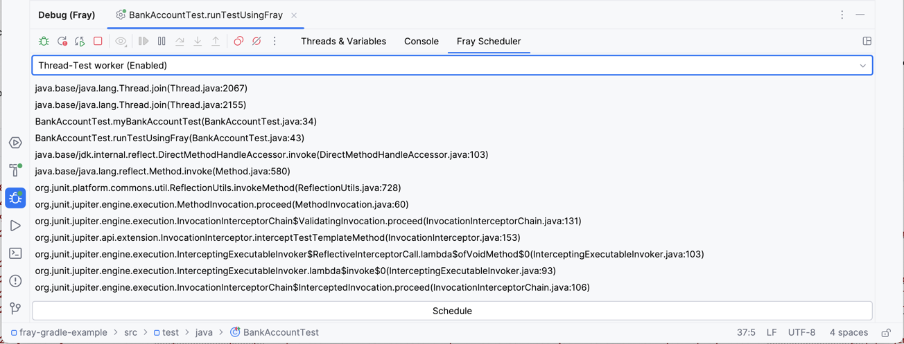
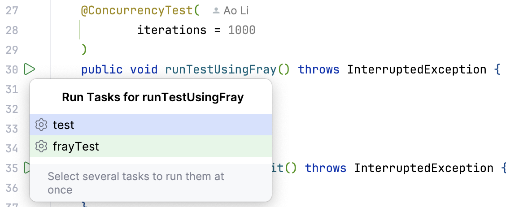
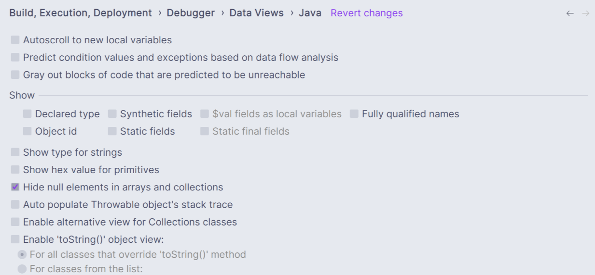

# Fray Debugger Plugin

<!-- Plugin description -->
Fray Idea Plugin allows you to control concurrent programs in your Intellij IDE!
<!-- Plugin description end -->

## Installation

- Using the IDE built-in plugin system:

  <kbd>Settings/Preferences</kbd> > <kbd>Plugins</kbd> > <kbd>Marketplace</kbd> > <kbd>Search for "Fray Debugger"</kbd> >
  <kbd>Install</kbd>

- Using JetBrains Marketplace:

  Go to [JetBrains Marketplace](https://plugins.jetbrains.com/plugin/26623-fray-debugger) and install it by clicking the <kbd>Install to ...</kbd> button in case your IDE is running.

  You can also download the [latest release](https://plugins.jetbrains.com/plugin/26623-fray-debugger/versions) from JetBrains Marketplace and install it manually using
  <kbd>Settings/Preferences</kbd> > <kbd>Plugins</kbd> > <kbd>⚙️</kbd> > <kbd>Install plugin from disk...</kbd>

## Usage

Fray Debugger Plugin provides an interactive interface to control the execution of concurrent programs. 

To launch Fray tests from IntelliJ, you'll need to add the Fray-instrumented JDK to IntelliJ's configuration. This can 
be done by first:

* when using Maven, running `mvn verify`, followed by `mvn dependency:copy-dependencies`
* when using Gradle, TODO

Then, in the `Run/Debug Configurations`, add the JDK in the `Build and run` section:


Click `Select alternative JRE` and navigate to the instrumented JDK: `${project_folder}/target/fray/fray-java`.
You will also need to add the following VM options:

```
-javaagent:$MODULE_DIR$/target/dependency/fray-instrumentation-agent-0.6.8.jar
-agentpath:$MODULE_DIR$/target/fray/fray-jvmti/libjvmti.so
```

Finally, you can then start the Fray Debugger, by selecting `Debug (Fray)` from the Run/Debug Configurations dropdown:


Once the test is launched, Fray Debugger Plugin will pause the program execution at each synchronization point. You can 
then control the execution of the program using the Fray Debugger Plugin interface:



The dropdown manu shows all threads in the program. You can select a thread to view its stack trace.


In the editor, Fray also shows the current line of execution and the thread name.


Once you have decided which thread to schedule, you can click the `Schedule` button to schedule the selected thread.
Note that a thread may note be scheduled if it is blocked or if it is not ready to run. Such a thread will 
be marked as `Paused`.


# Launch Fray Test Without Plugin (Normal concurrency tests)

You can launch Fray tests from the IDE and debug them as you would with any other JUnit test.



Select `frayTest` from the Gradle tool window to run all Fray tests in the project.


> [!WARNING]
> Fray debugger plugin only works with tests annotated with `@ConcurrencyTest` right now.


### Disable evaluations in debug mode

If you use IntelliJ debugger, you may notice that the replay sometimes failed. This is because the Intellij debugger
tries to evaluate the value of local variables when the program is paused. Evaluating these variables may trigger 
additional synchronization points leading to nondeterministic behavior in Fray. Thus, it is recommended to disable
these features. 

To disable Intellij evaluation, 
go to `File -> Settings -> Build, Execution, Deployment -> Debugger -> Data Views -> Java` and uncheck options that may 
lead to dynamic evaluation.


